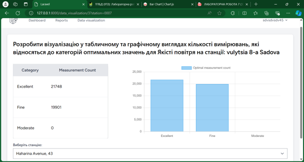

# Air Quality Monitoring Web Application

## Overview

This project is a web application for monitoring air quality. It provides users with up-to-date data about environmental conditions, collected from monitoring stations that regularly track (data is loaded from .csv file):

    - PM2.5 and PM10 levels (particulate matter)

    - Temperature

    - Humidity

    - Atmospheric pressure

    - Air Quality Index (AQI)

The application allows users to view data, generate reports, and see visualized analytics to help track environmental health and pollution trends.

### Screenshots

#### Interface

#### Reports

#### Charts

### Features

Database Management:

PostgreSQL database with a detailed logical ER model

Data import from CSV files using COPY command

Queries for extracting station data, optimal parameters, and measurements by location and date

### User Interface:

Built with Laravel (PHP framework) for smooth backend and database interactions

Authorization and user management features

Interactive dashboards for browsing and filtering data

Reporting and Visualization:

Laravel Excel for data import/export

Chart.js for visual data presentation

Power BI integration for advanced analytics

Database Administration:

Role creation and permissions management

Custom tablespace setup

Project database used as a template for further development

### Tech Stack

Backend: PHP, Laravel

Database: PostgreSQL

Visualization: Chart.js, Power BI

Data Handling: Laravel Excel
